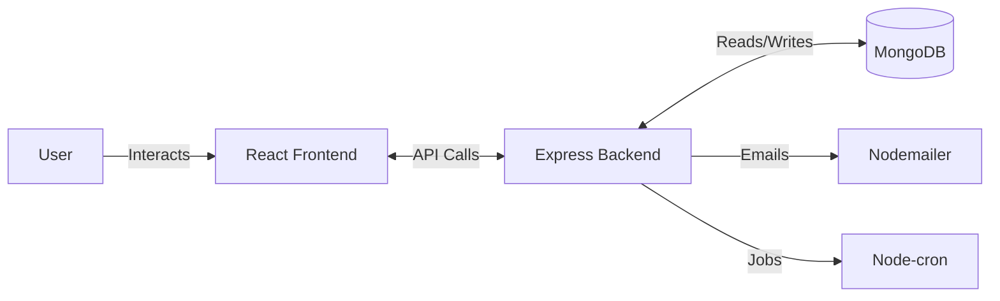

# JobNova - Your Smart Job Tracking Platform 
<p align="center">
  
</p>

---

## 🎯 About

JobNova is a modern, full-stack job and internship tracking platform that helps students and job seekers manage their applications efficiently.

Instead of relying on Excel sheets or scattered notes, JobNova provides a centralized system to track applications, monitor progress, manage deadlines, and stay organized throughout the job search journey.

---

## 🚀 Key Highlights

*  Centralized job application tracking
*  Real-time dashboard with analytics
*  Status tracking (Applied → Interview → Offer → Rejected)
*  Automated email notifications
*  Smart deadline reminders using cron jobs
*  Secure authentication using JWT
*  Modern responsive UI (Dark SaaS design)

---

## ✨ Features

### 👤 For Users

*  Add and manage job/internship applications
*  Update application status
*  Track progress through dashboard
*  Manage deadlines efficiently
*  Receive email notifications and reminders

### ⚙️ Core Features

*  JWT-based authentication system
*  Analytics (Application trends & status breakdown)
*  Nodemailer integration for notifications
*  Node-cron for scheduled reminders
*  Clean and responsive UI

---

## 🛠️ Tech Stack

### 🎨 Frontend

* ⚛️ React (Vite)
* 🎨 Tailwind CSS
* 🔌 Axios

### ⚙️ Backend

*  Node.js
*  Express.js
*  MongoDB + Mongoose
*  JWT Authentication
*  Nodemailer
*  Node-cron

### 🧰 Tools

* Git & GitHub
* Postman
* VS Code

---

## 🏗️ System Architecture

```
User (Browser)
      ↓
React Frontend (UI)
      ↓ API Calls
Node.js / Express Backend
      ↓
MongoDB (Database)

Extra Services:
- Nodemailer → Email Notifications
- Node-cron → Scheduled Jobs
```

---

## 📦 Installation

### 🔧 Prerequisites

* Node.js (v18+)
* MongoDB
* npm

---

### ⚙️ Backend Setup

=======
# JobNova

*Track smarter. Get hired faster.*

## What is JobNova?
JobNova is a modern job and internship application tracking web application. It helps students and job seekers avoid manual tracking in Excel or notes by providing a streamlined platform. Users can add applications, update statuses, manage deadlines, and track overall progress effortlessly. It provides a comprehensive dashboard, clear analytics, and automated email notifications to ensure you stay on top of your job hunt.

## Key Features
- User authentication
- Add, edit, view, and delete applications
- Track application status
- Dashboard overview
- Analytics charts
- Email notifications using Nodemailer
- Deadline reminders
- Responsive modern UI

## Tech Stack

| Category | Technologies |
| :--- | :--- |
| **Frontend** | React, Vite, Tailwind CSS, Axios |
| **Backend** | Node.js, Express.js, MongoDB, Mongoose, JWT, Nodemailer, Node-cron |
| **Tools** | Git, GitHub, Postman, VS Code |

## System Design Diagram



## Folder Structure

```text
JobNova/
├── frontend/
│   ├── src/
│   ├── components/
│   ├── pages/
│   └── package.json
├── backend/
│   ├── controllers/
│   ├── models/
│   ├── routes/
│   ├── middleware/
│   ├── utils/
│   └── server.js
└── README.md
```

## Installation & Setup

**1. Clone the repository:**
```bash
git clone <your-repo-url>
cd JobNova
```

**2. Backend Setup:**
>>>>>>> a0503a0 (Updated README and added screenshots)
```bash
cd backend
npm install
npm run dev


### 🎨 Frontend Setup

cd InternTrack
npm install
npm run dev


## ⚙️ Configuration

### 🔑 Backend (.env)


PORT=5000
MONGODB_URI=your_mongodb_connection_string
JWT_SECRET=your_jwt_secret
JWT_EXPIRES_IN=7d

MAIL_HOST=smtp.gmail.com
MAIL_PORT=587
MAIL_USER=your_email@gmail.com
MAIL_PASS=your_app_password


### 🌐 Frontend (.env)

VITE_API_BASE_URL=http://localhost:5000/api


## 🚀 Usage

### ▶️ Start the Application

**Backend**

```bash
cd backend
npm run dev
```

**Frontend**

```bash
cd InternTrack
npm run dev
```

---

### 🌐 Access

* Frontend: http://localhost:5173
* Backend API: http://localhost:5000

---

## 🌐 Live Demo

🚀 https://your-jobnova-link.com

---

---

## 🔮 Future Improvements

* 🤖 AI Resume Suggestions
* 🔍 Advanced Filtering & Search
* 📅 Calendar Integration
* 📤 Export Reports (PDF/CSV)
* 🏢 Company Insights

---

## 👨‍💻 Author

**Sarthak Godbole**
=======
## How to Use
- Register or login.
- Add a job/internship application.
- Update status as progress changes.
- Check dashboard and analytics.
- Receive email reminders/notifications.

## Future Improvements
- AI resume analysis
- Advanced filtering
- Calendar integration
- Export reports
- Company-wise insights

## Author
Developed by Sarthak Godbole
