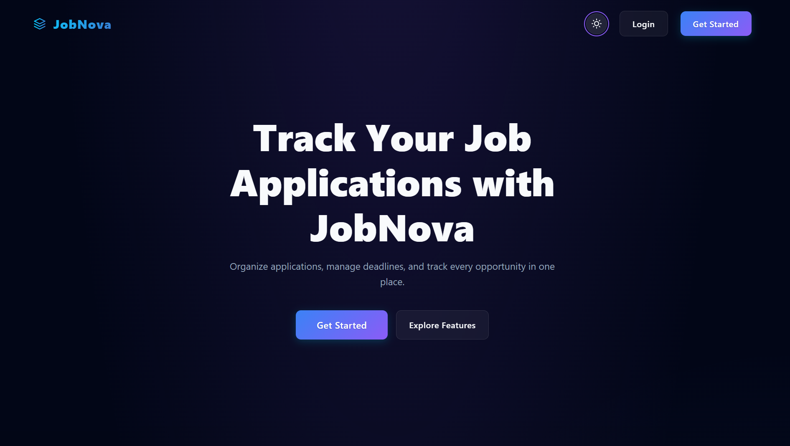

# JobNova - Your Smart Job Tracking Platform

<p align="center">
  
</p>

---

## 🎯 About

JobNova is a modern, full-stack job and internship tracking platform that helps students and job seekers manage their applications efficiently.

Instead of relying on Excel sheets or scattered notes, JobNova provides a centralized system to track applications, monitor progress, manage deadlines, and stay organized throughout the job search journey.

---

## 🚀 Key Highlights

* Centralized job application tracking
* Real-time dashboard with analytics
* Status tracking (Applied → Interview → Offer → Rejected)
* Automated email notifications
* Smart deadline reminders using cron jobs
* Secure authentication using JWT
* Modern responsive UI (Dark SaaS design)

---

## ✨ Features

### 👤 For Users

* Add and manage job/internship applications
* Update application status
* Track progress through dashboard
* Manage deadlines efficiently
* Receive email notifications and reminders

### ⚙️ Core Features

* JWT-based authentication system
* Analytics (Application trends & status breakdown)
* Nodemailer integration for notifications
* Node-cron for scheduled reminders
* Clean and responsive UI

---

## 🛠️ Tech Stack

### 🎨 Frontend

* React (Vite)
* Tailwind CSS
* Axios

### ⚙️ Backend

* Node.js
* Express.js
* MongoDB + Mongoose
* JWT Authentication
* Nodemailer
* Node-cron

### 🧰 Tools

* Git & GitHub
* Postman
* VS Code

---

## 🏗️ System Architecture

```text
           +----------------------+
           |        User          |
           |      (Browser)       |
           +----------+-----------+
                      |
                      v
           +----------------------+
           |   React Frontend     |
           |     (UI - Vite)      |
           +----------+-----------+
                      |
                   API Calls
                      |
                      v
           +----------------------+
           |  Node.js / Express   |
           |       Backend        |
           +----+-----------+-----+
                |           |
                v           v
     +----------------+   +----------------------+
     |    MongoDB     |   |  External Services   |
     |   Database     |   |----------------------|
     +----------------+   | Nodemailer (Emails) |
                          | Node-cron (Jobs)    |
                          +----------------------+

---
```

## 📁 Folder Structure

```bash
JobNova/
├── frontend/
│   ├── src/
│   │   ├── components/
│   │   ├── pages/
│   │   ├── context/
│   │   ├── layouts/
│   │   └── lib/
│   └── package.json
│
├── backend/
│   ├── controllers/
│   ├── models/
│   ├── routes/
│   ├── middleware/
│   ├── utils/
│   └── server.js
│
├── assets/
│   ├── Landingpage.png
│   ├── dashboard.png
│   └── analytics.png
│
└── README.md
```

## 📦 Installation & Setup

### 1. Clone the repository

```bash
git clone https://github.com/SarthakGodbole/JobNova
cd JobNova
```

### 2. Backend Setup

```bash
cd backend
npm install
npm run dev
```

### 3. Frontend Setup

```bash
cd InternTrack
npm install
npm run dev
```

---

## 🔑 Environment Variables

### Backend (.env)

```env
PORT=5000
MONGODB_URI=your_mongodb_connection_string
JWT_SECRET=your_jwt_secret
JWT_EXPIRES_IN=7d

MAIL_HOST=smtp.gmail.com
MAIL_PORT=587
MAIL_USER=your_email@gmail.com
MAIL_PASS=your_app_password
```

### Frontend (.env)

```env
VITE_API_BASE_URL=http://localhost:5000/api
```

---

## 🚀 Usage

1. Register or login
2. Add job/internship applications
3. Update status as progress changes
4. Track everything from dashboard
5. Receive email reminders automatically

---

## 🌐 Live Demo

🚀 https://your-jobnova-link.com

---

## 🔮 Future Improvements

* AI Resume Suggestions
* Advanced Filtering & Search
* Calendar Integration
* Export Reports (PDF/CSV)
* Company Insights

---

## 👨‍💻 Author

**Sarthak Godbole**

